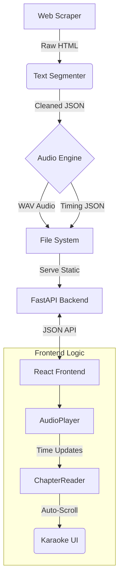

# NovelLabs AudioBook Generator

> **Turn any web novel into an immersive audiobook experience.**  
> A complete production pipeline featuring smart scraping, intelligent text segmentation, and high-quality GPU-accelerated TTS.


## ✨ Key Features

### 🎤 Karaoke-Style Reading
Experience novels like never before. As the audio plays, the current text chunk is **highlighted in real-time** and the page **auto-scrolls** to follow the narration.
* *Audio & text perfectly synced using generated timing data.*

### 🧠 Smart Background Scraping
Don't let missing chapters stop you. The system automatically detects missing content and launches **concurrent scraping jobs** in the background, managed via a floating status panel.
* *CloudFlare bypass included.*

### 🎧 High-Quality Neural TTS
Powered by **Kokoro TTS**, producing human-like narration with emotional range.
* **10+ Voices**: British, American
* **GPU Accelerated**: Blazing fast generation on NVIDIA cards.

### 📚 Personal Library
Manage your collection with a beautiful, dark-themed UI. Track your reading progress, resume where you left off, and customize fonts and themes.

---

## 🏗️ Architecture



## 🚀 Quick Start

### Prerequisites
- Python 3.10+
- Node.js 18+
- NVIDIA GPU (Recommended for speed)

### 1. Backend Setup
```bash
# Clone the repo
git clone https://github.com/yourusername/NovelLabs.git
cd NovelLabs

# Setup Python Environment
python -m venv .venv
.venv\Scripts\activate

# Install Dependencies
pip install -r requirements.txt
python -m spacy download en_core_web_sm

# Start Server
python -m uvicorn src.api.main:app --reload --port 8001
```

### 2. Frontend Setup
```bash
cd web
npm install
npm run dev
```

Visit **http://localhost:5173** to start reading!

---

## 🗺️ Project Roadmap

We are actively expanding NovelLabs. Here is what's coming next:

- [ ] **Database Integration**: Migrate to SQLite/PostgreSQL for robust data handling.
- [ ] **Personalized Libraries**: View and follow other users' reading lists and libraries.
- [ ] **Advanced TTS**: Integrate **Qwen3-TTS** for next-gen voice quality.
- [ ] **Character Voice Mapping**: Auto-detect dialogue speakers and assign distinct voices.
- [ ] **Multi-Source Scraping**: Plugins for RoyalRoad, WebNovel, and ScribbleHub.
- [ ] **UI/UX Polish**: Enhanced animations and mobile-responsive layout.

---


## 📂 Project Structure

```
NovelLabs/
├── audio/              # Generated WAVs & Timing JSONs
├── data/               # Scraped Novel Text
├── src/
│   ├── api/            # FastAPI Routes & Logic
│   ├── scraper.py      # Selenium/BS4 Scraper
│   └── segmenter.py    # NLP Text Chunking
└── web/                # React Frontend (Vite)
    ├── src/
    │   ├── components/ # UI Components (AudioPlayer, etc.)
    │   └── pages/      # Views (Library, ChapterReader)
```

## 🤝 Contributing
Contributions are welcome! Please open an issue or PR for any features in the roadmap.

## 📄 License
MIT License.
