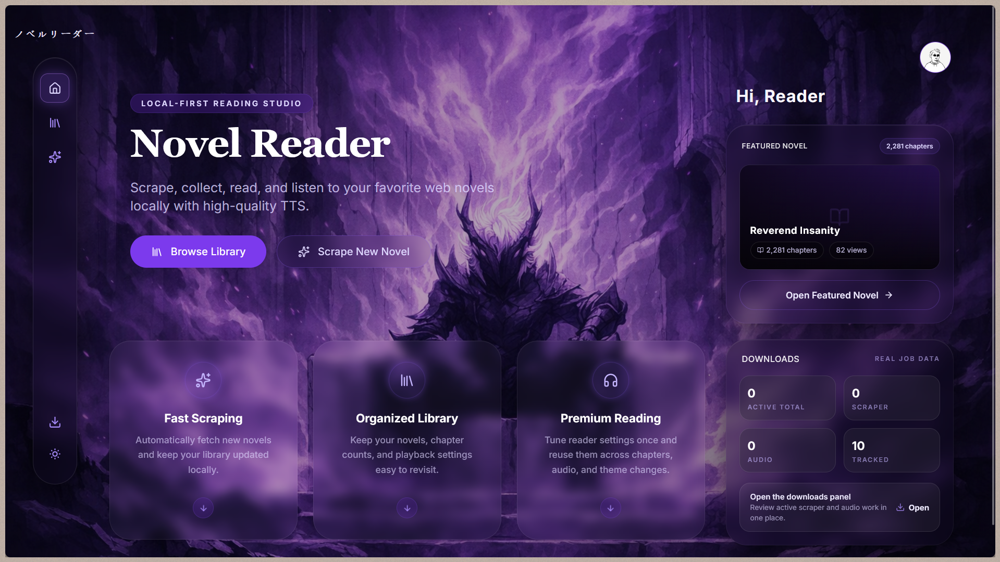
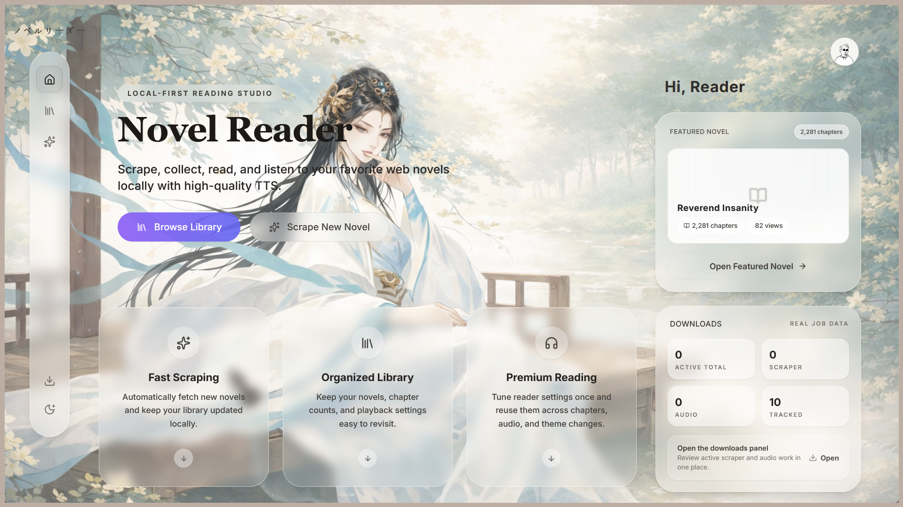
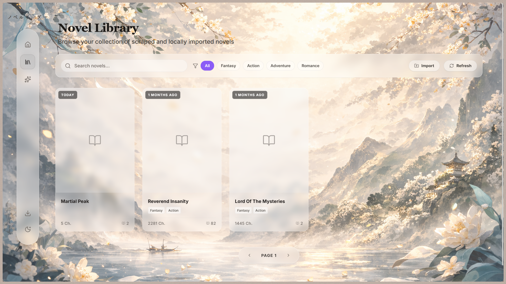
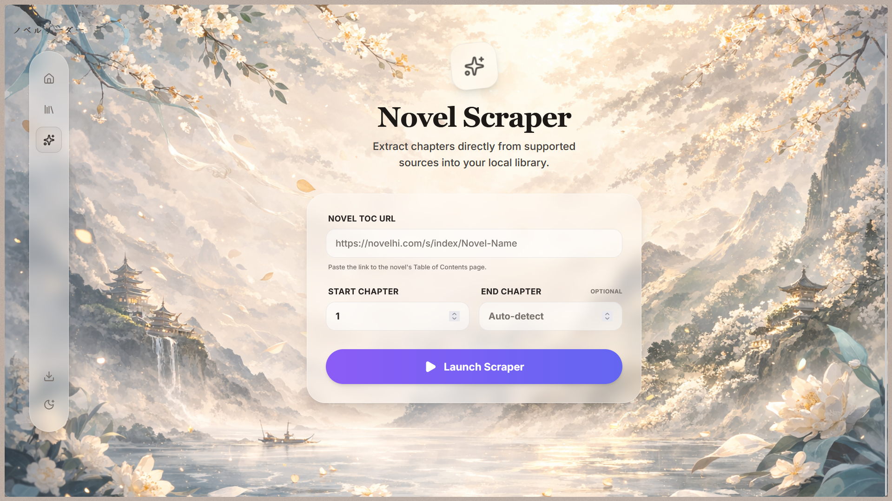

# NovelLabs

> **Turn any web novel into an immersive audiobook experience.**

A local-first reading and audiobook pipeline with intelligent text segmentation and GPU-accelerated TTS.

## Why this is interesting
NovelLabs bridges the gap between raw web scraped text and a premium audible experience. It intelligently segments chapters, generates perfectly timed JSON data alongside local WAV files, and syncs them in a karaoke-style web player. No cloud subscriptions, no API limits — just your library, processed by state-of-the-art open models right on your machine.

## Key Features
- **Karaoke-Style Reading**: Real-time text highlighting and intelligent handoff scrolling that seamlessly follows the audio playback chunk by chunk.
- **High-Quality Local Neural TTS**: Out-of-the-box support for Kokoro (in-process) and Qwen3 TTS (via local server), including voice-cloning capabilities.
- **Dual-Theme Design**: Features a beautiful, glassmorphism UI that fully supports and dynamically switches between rich light and dark themed reading experiences. Built-in interactive floating audio players hand off seamlessly as you read.
- **Personal Library Management**: Track reading progress, manage downloads, and customize your experience with local SQLite storage.

---

## Screenshots


*The default dark fantasy reading dashboard.*

### Same app, two complete moods

 

### Library Overview



### Chapter Reader & Audio Handoff


### Novel Detail & Voice Workflow



### Generation Tracking


---

## Local Imports

You can import your own local novels, short stories, or books and seamlessly convert them into high-quality audiobooks. Your imported content and reading progress are saved both locally on your file system and securely tracked in the database for a fully private, offline experience.

---

## Audio Demos

### Kokoro Voice Demos
Kokoro features incredibly natural narration with **more than 10 built-in voices** to choose from out-of-the-box. 

Two voice demos are provided:

- **af_heart** (American Female)
  <br>
  <audio controls src="demos/audio_readme/kokoro/Chapter_0028.wav"></audio>
- **george** (British Male)
  <br>
  <audio controls src="demos/audio_readme/kokoro/Chapter_1497.wav"></audio>

Feel free to try the other voices as well!

### Qwen3 Voice Cloning Demos
The advanced Qwen3 integration allows for powerful zero-shot voice cloning. Provide a short reference audio of any voice (minimum 5 seconds), and NovelLabs will generate the entire audiobook in that exact voice!

**Demo 1**
- Reference Audio:
  <br>
  <audio controls src="demos/audio_readme/qwen3-tts/audio1/qwen3_reference.wav"></audio>
- Generated Audiobook:
  <br>
  <audio controls src="demos/audio_readme/qwen3-tts/audio1/Chapter_0023.wav"></audio>

**Demo 2**
- Reference Audio:
  <br>
  <audio controls src="demos/audio_readme/qwen3-tts/audio2/reference2.wav"></audio>
- Generated Audiobook:
  <br>
  <audio controls src="demos/audio_readme/qwen3-tts/audio2/Chapter_0079.wav"></audio>

NOTE: the refernce audio has to be in .wav format.
---

## Quick Start (Kokoro TTS)

The fastest way to get started using the built-in Kokoro TTS engine. 

### Prerequisites
- Python **3.11 or 3.12** (Kokoro relies on specific dependency versions not fully supported on 3.13+)
- Node.js 18+
- NVIDIA GPU with CUDA (strongly recommended)

### 1. Start the Backend
```bash
# 1. Create and activate a virtual environment
python -m venv .venv
# Windows: .venv\Scripts\activate | macOS/Linux: source .venv/bin/activate

# 2. Install dependencies
pip install -r requirements.txt

# 3. Start the server (runs on port 8001)
python -m uvicorn src.api.main:app --reload --port 8001
```

Backend logs are written to both terminal and rotating files:
- `logs/backend/app.log` (general backend flow)
- `logs/backend/audio_progress.log` (audio lifecycle and chunk progress)
- `logs/backend/errors.log` (warnings, errors, and exceptions)

### 2. Start the Frontend
```bash
# In a new terminal
cd web
npm install
npm run dev
```
Open **http://localhost:5173** in your browser.

---

## Deep Dive: TTS Setup

NovelLabs supports two distinct TTS flows. Kokoro is the simplest and runs directly inside the backend process. Qwen requires a sibling repository sidecar.

### 1. Kokoro Setup (Default)
By default, the backend loads Kokoro. Ensure your `.env` contains:
```env
TTS_PROVIDER=kokoro
TTS_DEVICE=auto
TTS_VOICE=af_heart
```
**To verify the active provider**: Look at startup logs for `Loaded Kokoro provider on ...` in terminal or `logs/backend/app.log`.

> **Common Kokoro Pitfall**: If you encounter errors related to `misbah/soundfile` or unsupported dependencies, you are likely running Python 3.14 or a newer incompatible version. Recreate your `.venv` explicitly with Python 3.11 or 3.12.

### 2. Qwen Setup (Advanced)
Qwen runs as a separate local server. You must clone the `faster-qwen3-tts` repository as a **sibling** directory to this project, not inside it!

1. **Clone the sibling repo and setup its environment**:
```bash
# Go to the parent directory of NovelLabs
git clone https://github.com/andimarafioti/faster-qwen3-tts.git
cd faster-qwen3-tts
python -m venv .venv
# Activate the venv and install
pip install ".[demo]"
```

2. **Start the Qwen Service on port 8000**:
There are two distinct runmodes for Qwen depending on your goal.

*Standard Synthesis (OpenAI Mode)*:
```bash
python -m faster_qwen3_tts.examples.openai_server --model Qwen/Qwen3-TTS-12Hz-0.6B-Base --language English --port 8000
```
*Voice Cloning (Demo Mode)* - **Required** for the uploaded reference voice flow:
```bash
python demo/server.py --model Qwen/Qwen3-TTS-12Hz-0.6B-Base --port 8000
```

> **Recommended Model**: Strongly recommend sticking to `Qwen/Qwen3-TTS-12Hz-0.6B-Base`. **DO NOT** use `CustomVoice` configurations if you want to use the uploaded reference-voice cloning flow within NovelLabs.

3. **Configure the NovelLabs `.env`**:
```env
TTS_PROVIDER=qwen3
QWEN_TTS_BASE_URL=http://localhost:8000
QWEN_TTS_API_STYLE=demo  # or 'openai' depending on how you started it
QWEN_TTS_MODEL=Qwen/Qwen3-TTS-12Hz-0.6B-Base
```

---

## Troubleshooting & Pitfalls

If you hit a wall, check these specific issues we've verified during development:

- **Changed `.env` but provider did not switch**
  The active TTS provider is loaded dynamically on backend startup. You must restart the `uvicorn` process for changes to take effect.
- **Qwen service refused connection**
  Ensure the Qwen server is actually running, bound to port `8000`, and that you launched it from inside the `faster-qwen3-tts` repo, not the NovelLabs root.
- **Ran `demo/server.py` from this repo**
  The `demo/server.py` script is explicitly part of the `faster-qwen3-tts` repository. Starting it from inside NovelLabs will fail.
- **CUDA graphs require CUDA device**
  You have the CPU-only version of PyTorch installed. **Fix**: Wipe the environment in your `faster-qwen3-tts` folder and reinstall PyTorch with the specific `--index-url` for your CUDA version before installing the repo requirements.
- **Safetensor invalid JSON / corrupted model download**
  This happens when the Hugging Face cache gets interrupted. **Fix**: Delete the cached Qwen model from your `~/.cache/huggingface/hub` folder and restart the server to force a clean redownload.
- **SoX warning on Windows**
  You may see a `sox` missing warning in your terminal on Windows. You can safely ignore this; it is not the primary blocker for audio generation.
- **Wrong Qwen model for voice cloning**
  The `CustomVoice` models do not support the zero-shot uploaded reference voice flow. You must use a `Base` model (like `Qwen/Qwen3-TTS-12Hz-0.6B-Base`).
- **Qwen takes a long time or seems stuck**
  Chapters are chunked for processing. Long chapters can take many per-chunk requests. Ensure the frontend progress bar is incrementing—it is normal for an entire chapter to take 1-3 minutes depending on your GPU.
- **Frontend still shows old behavior**
  If you swapped from Kokoro to Qwen or changed the `API_STYLE`, always hard refresh the frontend (`Ctrl/Cmd + Shift + R`) and confirm the backend was restarted.

---

## Architecture

NovelLabs is designed for local ownership.

- **Local SQLite**: All progress, libraries, and settings are handled via `sqlite` in the `data/` folder.
- **Local Audio Output**: Everything caches to `/audio/` and serves directly to the React frontend.
- **Local Qwen Sidecar**: Keeps the main app lightweight by offloading heavy ML inference to a dedicated sibling API.

```text
NovelLabs/
├── audio/              Generated WAV files and timing JSON
├── data/               SQLite database and output text files
├── docs/screenshots/   Project demonstration images
├── src/api/            FastAPI backend, TTS routing, segmenter
└── web/                React frontend (Vite)
```

---

*Open Source & Credits* 
Built and open-sourced for local reading enthusiasts. If you find this useful, consider contributing or tracking development on [GitHub](https://github.com/MohitRawat017/NovelLabs).

<!--
CONTRIBUTOR NOTE: What gets engagement?
When updating screenshots for a launch or PR, prioritize:
1. Dark mode home page (most dramatic/eye-catching).
2. Light vs. dark comparison strictly adjacent to prove the theme work.
3. Chapter reader showing the synced karaoke highlight along with the glassmorphism audio player.
4. Qwen voice profile / per-novel tracking to highlight local AI capability.
5. The library overview with populated, real data (not placeholder cards).
- Full-page screenshots typically perform better than tightly cropped fragments. 
-->
